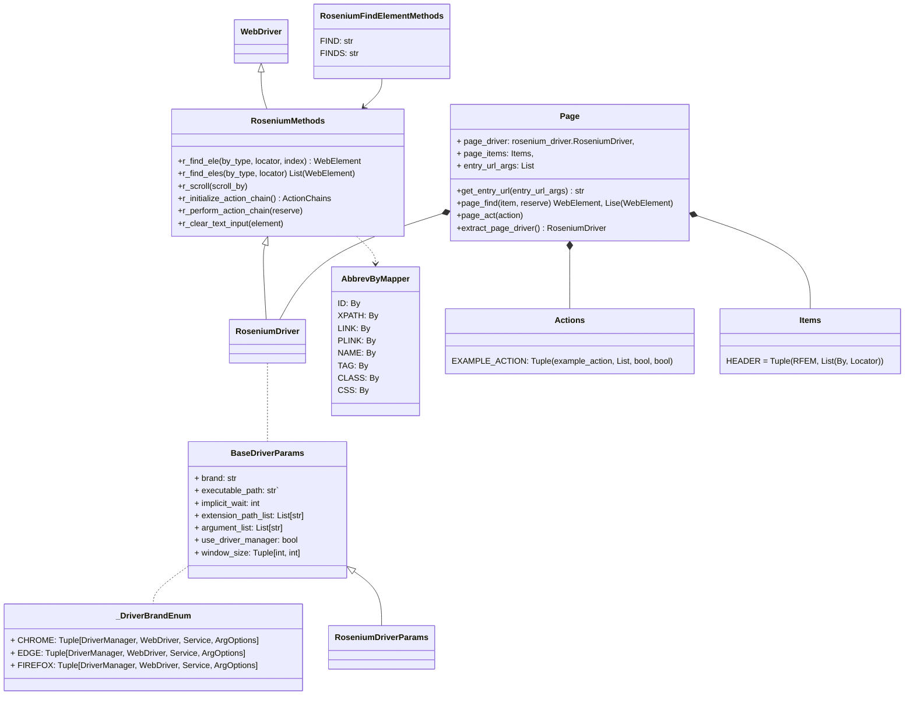
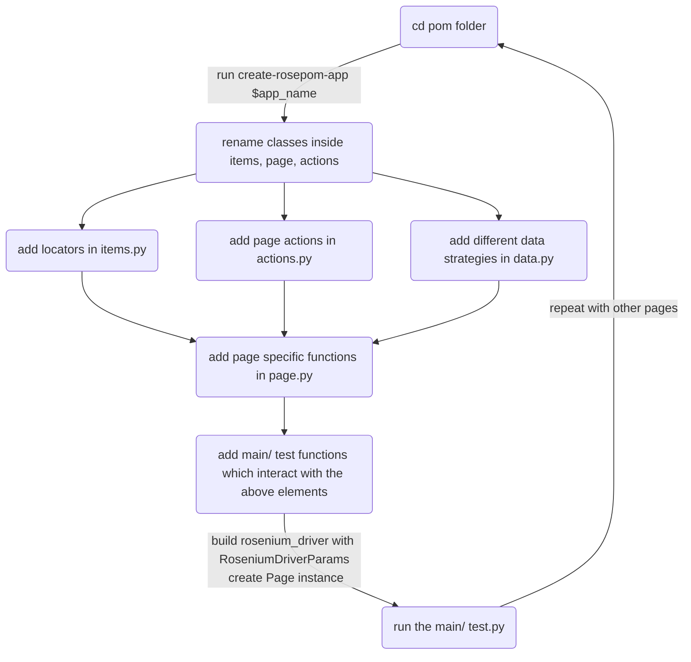

# Pyrosenium
## Introduction
This project/ framework is developed to support software QA engineer to facilitate their jobs. It provides two packages -- `rosenium` and `rosepom`.

### Rosenium
The `rosenium` package provides a short cut to construct a Selenium WebDriver class with help of a dataclass `RoseniumDriverParams`. This dataclass provides crucial hints for setting up a WebDriver. The packae method -- `build_rosenium_driver` makes use of `RoseniumDriverParams` to construct a WebDriver instance. It at the same time injects custom shorthand methods to the WebDriver class. This aims to help developers to quickly write scripts that require WebDriver.

You can create your own `rosenium_driver` with your custom `RoseniumMethods` by creating a `RoseniumMethods` class that is in line with the default one inside `_rosenium_methods.py`, and then passing it as an argument to the `build_rosenium_driver` method.

### Rosepom
The `rosepom` package provides a command to quickly generate pom templates. Simply run `create-rosepom-app $app_name` to create page specific pom based on the package template.
```
Template directory:
$your_folder
  |
  |__ $app_name
    |
    |__ __init__.py
    |__ actions.py
    |__ data.py
    |__ items.py
    |__ page.py
```
The template folder should include the following 4 files.
- actions.py:
  - You may define action functions in this page, and then register them inside $app_nameActions as indicated in the EXAMPLE_ACTION.
- data.py
  - Any data object, such as dict, list, etc.
  - You may put different data strategies here for different testing cases.
- items.py
  - You may define page items such as a div, a button, etc.
- page.py
  - Contains a $app_namePage object to be called in your script. You can interact with this object to use items and page actions as mentioned respectively in the $app_nameItems and $app_nameActions classes.

If you have custom `RoseniumMethods` and would like to use the custom methods on the `Page` object's page_find method, you can create an Enum class that includes the methods name; then importing and using it in the `Items` and `Actions` objects as a shortcut. Please see the source codes for more details.


## Examples
### Using rosenium_driver
Please see ~/../tests/rosenium/core/*
### Using rospom model
Please see ~/../tests/rosepom/core/*

## Diagrams
### Class diagram

## Rosepom flowchart

